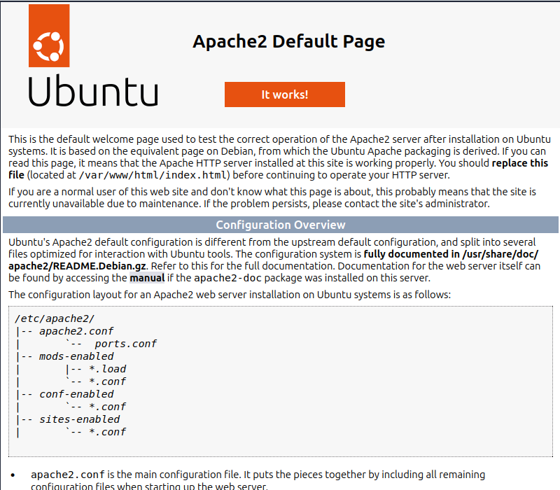
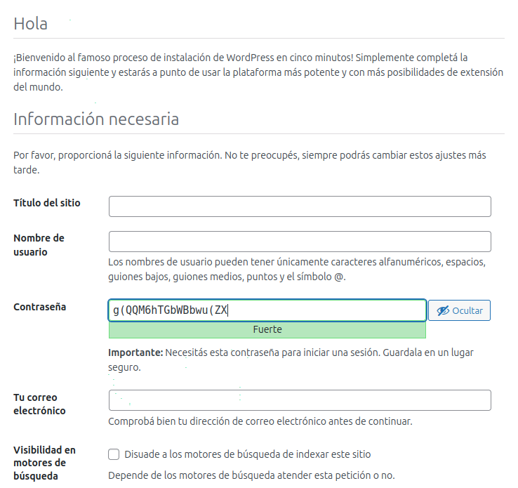
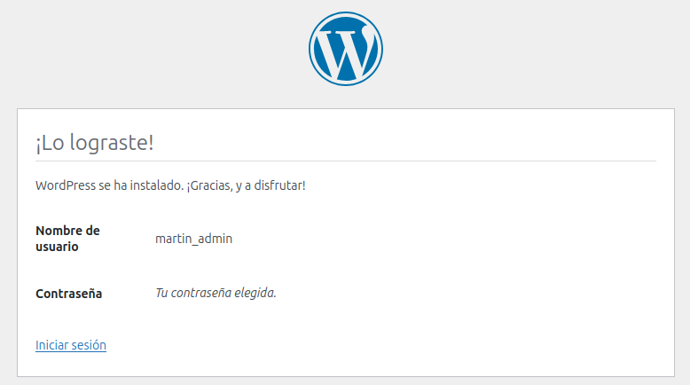

# Proyecto 1: Servidor Web con Stack LAMP y WordPress

## 1. Descripción del Proyecto

Este proyecto documenta el proceso completo de instalación y configuración de un servidor web desde cero en un servidor Ubuntu 24.04 LTS. El objetivo fue construir manualmente el clásico stack LAMP (Linux, Apache, MySQL, PHP) para desplegar una instancia funcional del sistema de gestión de contenidos WordPress.

Este es un proyecto fundamental que demuestra las habilidades básicas de administración de sistemas Linux, configuración de servicios de red y gestión de bases de datos.

**Tecnologías Utilizadas:**
*   **Sistema Operativo Anfitrión:** Linux Mint 22.1
*   **Software de Virtualización:** Oracle VirtualBox
*   **Sistema Operativo Invitado:** Ubuntu Server 24.04 LTS
*   **Servidor Web:** Apache2
*   **Base de Datos:** MySQL Server
*   **Lenguaje de Scripting:** PHP y sus módulos (`libapache2-mod-php`, `php-mysql`, etc.)
*   **Aplicación:** WordPress

---

## 2. Pasos de la Implementación

El despliegue se realizó siguiendo una secuencia lógica para construir el stack componente por componente.

### a) Instalación y Configuración de Apache
Se instaló el servidor web Apache2 y se verificó su funcionamiento accediendo a la página de bienvenida por defecto. Se configuró el firewall UFW para permitir el tráfico web en los puertos 80 y 443.

### b) Instalación de MySQL
Se instaló el servidor de bases de datos MySQL. Se ejecutó el script de seguridad `mysql_secure_installation` para establecer una contraseña de root y eliminar configuraciones inseguras. Posteriormente, se creó una base de datos y un usuario dedicado (`wordpress_db` y `wordpress_user`) para la aplicación WordPress, siguiendo las mejores prácticas de seguridad.

### c) Instalación de PHP
Se instaló PHP junto con los módulos necesarios para que WordPress pudiera comunicarse tanto con el servidor Apache como con la base de datos MySQL.

### d) Despliegue de WordPress
Finalmente, se descargó la última versión de WordPress. Los archivos se ubicaron en el directorio raíz de Apache (`/var/www/html/`) y se ajustaron los permisos para que el servidor web pudiera gestionarlos. La instalación se completó a través de la conocida interfaz web de 5 minutos de WordPress.

 
---

## 3. Retos y Aprendizajes

Durante la fase de configuración de la base de datos, me encontré con el error **"No se puede seleccionar la base de datos"** en la interfaz de WordPress. Para resolverlo, tuve que:

1.  Ingresar a la consola de MySQL (`sudo mysql -u root -p`).
2.  Verificar que la base de datos existía con `SHOW DATABASES;`.
3.  Verificar los permisos del usuario con `SHOW GRANTS FOR 'wordpress_user'@'localhost';`.
4.  Descubrí un error de tipeo en el comando `GRANT ALL PRIVILEGES...` que había ejecutado.

Este ejercicio de depuración fue clave y me enseñó la importancia de la precisión en los comandos y cómo verificar sistemáticamente los permisos en una base de datos.